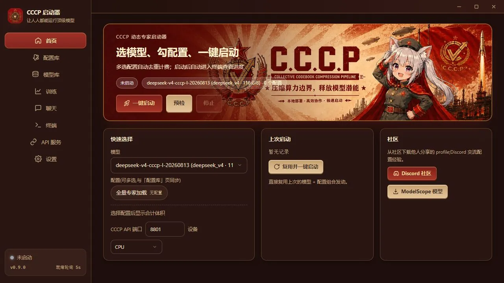

# C.C.C.P.

<p align="center">
  <a href="README.md">简体中文</a> · <strong>English</strong> · <a href="README_RU.md">Русский</a>
</p>

<p align="center">
  
</p>

<p align="center">
  <strong>Collective Codebook Compression Pipeline</strong><br>
  Quantization, task-aware expert detection, and multi-backend inference for large MoE models
</p>

<p align="center">
  
  
  
  
</p>

> C.C.C.P. makes large MoE models easier to run on ordinary computers. It does not remove experts or modify the original model weights. Instead, it combines quantization, task-corpus route detection, expert-residency profiles, and optimized operators so that limited memory is assigned first to experts that the current workload actually uses.

## Core advantages

| Direction | Capability | Practical benefit |
| --- | --- | --- |
| **More Useful** | One package, open and run | The launcher, isolated Python runtime, inference dependencies, and operators are bundled. Users do not need to install Python. |
| **More Saving** | Quantization + expert detection | Dense and shared-expert storage is accounted for first, then dynamic experts are selected under the profile budget. Duplicate experts across combined profiles are counted only once. |
| **More Smart** | Expert pre-selection | Real task corpora produce layer-by-layer expert heatmaps, allowing the most relevant experts to stay resident first. |
| **More Rapid** | Smaller model + extensive optimization | Codebook caching, CPU-accelerated operators, and isolated backend environments are used. Actual throughput depends on the model, memory bandwidth, and hardware. |

## This is not model training

“Training” in the launcher creates expert configuration files only:

- it does not generate a new model;
- it does not modify or prune model weights;
- it does not change the model's original top-k routing rules;
- each profile records the model name, version, fingerprint, and per-layer expert IDs;
- profiles can be exported, shared, combined, and deduplicated.

Long-context corpora are processed with pure prefill in `4096-token` blocks while expert hits are recorded throughout the complete context. For long-context workloads, start with a scan budget of roughly `500,000 tokens`, then adjust it based on the heatmap coverage curve and target profile size.

## Standardized evaluation

The evaluation uses DeepSeek-V4-Flash-0731 on WikiText-2 with a fixed `ctx=512`: `573 chunks / 146,115` scored tokens. The reference distribution comes from BF16 logits produced by the official runtime.

| Method | Size (GiB) | Mean KLD ↓ | same-top ↑ | Execution |
| --- | ---: | ---: | ---: | --- |
| **CCCP-S** | **76.473** | **0.291115** | **83.0846%** | full-resident TP1×6 |
| MFQ EW-V2-S | 77.519 | 0.313576 | 82.2913% | streamed TP1×6, B4 |
| UD-IQ1_S | 76.871 | 0.645514 | 73.8110% | llama.cpp |
| UD-IQ3_XXS | 97.051 | 0.306343 | 82.0150% | llama.cpp |
| UD-IQ4_NL | 127.277 | 0.180695 | 86.0750% | llama.cpp |

Using the theoretical BF16 weight bytes for the official `284B` parameter count as the baseline:

| Theoretical BF16 | CCCP-S | Theoretical compression | Weight-byte reduction | Effective width |
| ---: | ---: | ---: | ---: | ---: |
| 528.991 GiB | 76.473 GiB | **6.92×** | **85.54%** | **≈2.31 bit/parameter** |

At nearly the same size, CCCP-S reduces Mean KLD by approximately `54.90%` and raises same-top by `9.2736` percentage points compared with UD-IQ1_S. Compared with MFQ EW-V2-S, it is `1.046 GiB` smaller, reduces Mean KLD by approximately `7.16%`, and raises same-top by `0.7933` percentage points.

> Note: 6.92× and 85.54% are calculated against the theoretical BF16 bytes for 284B parameters. They are not the compression ratio of the official mixed-precision download package. The compared methods use different execution paths, so these results demonstrate size–fidelity efficiency rather than throughput.

Sources:

- [Original experiment repository](https://github.com/Tylogi/TyloQuant)
- [Evaluation protocol and complete results](https://github.com/Tylogi/TyloQuant/blob/master/README.zh-CN.md)
- [Official DeepSeek-V4-Flash model card](https://huggingface.co/deepseek-ai/DeepSeek-V4-Flash)

## Launcher interface

<p align="center">
  
</p>

<p align="center">
  
</p>

## Quick start

1. Download the complete Windows package from [Baidu Netdisk](https://pan.baidu.com/s/14ichCAsXKZMUQInIwIfQcA?pwd=cccp), extraction code: `cccp`.
2. Extract the complete package to a writable directory. Do not run it from inside the archive.
3. Put a compatible model containing `cccp.json` in the `models` directory next to the application.
4. Double-click `CCCP-Launcher.exe`.
5. Select a model and an expert profile. A model can also be fully loaded when no profile is available.
6. Run preflight checks, review the estimated RAM/VRAM requirement, and start the model.

When available RAM or VRAM is insufficient, the launcher gradually falls back to mapped memory or disk offload. Inference can continue, but performance may drop substantially.

## Build a task-specific expert profile

1. Select a detected CCCP model on the Training page.
2. Import a UTF-8 `JSONL` or `TXT` corpus.
3. Set the token scan budget and start pure-prefill route scanning.
4. Inspect the per-layer expert heatmap and cumulative coverage curve.
5. Adjust coverage and review the estimated profile size.
6. Enter a profile name and description, then save or export it.

Corpora are stored locally by the application and can be reused after a restart or removed from the corpus library.

## Runtime environment

- Windows x64;
- CPU is the default and most portable inference path;
- isolated NVIDIA CUDA environments can be detected automatically;
- compatible AMD ROCm/HIP environments can be detected automatically;
- users do not need to install Python;
- the release package includes the runtime, dependencies, and precompiled or automatically compiled acceleration operators.

## Automatic update check

Stable-channel machine-readable manifest:

```text
https://raw.githubusercontent.com/Value99/CCCP/main/latest.json
```

PowerShell example:

```powershell
$release = Invoke-RestMethod 'https://raw.githubusercontent.com/Value99/CCCP/main/latest.json'
$release.version
$release.download.url
$release.launcher.sha256
```

`latest.json` uses the fixed schema identifier `cccp-launcher-update-v1`. The launcher should validate `schema`, compare semantic versions, and verify the downloaded file with SHA-256.

## Links

- Download: [Baidu Netdisk · code cccp](https://pan.baidu.com/s/14ichCAsXKZMUQInIwIfQcA?pwd=cccp)
- Community: [Discord](https://discord.gg/eNnwmAUY4M)
- Models: [ModelScope · ValueFX](https://www.modelscope.cn/profile/ValueFX)
- Source: [GitHub · Value99/CCCP](https://github.com/Value99/CCCP)

---

If this project is useful to you, please click **Star** in the upper-right corner so more people can discover a practical way to run large MoE models on everyday hardware.
