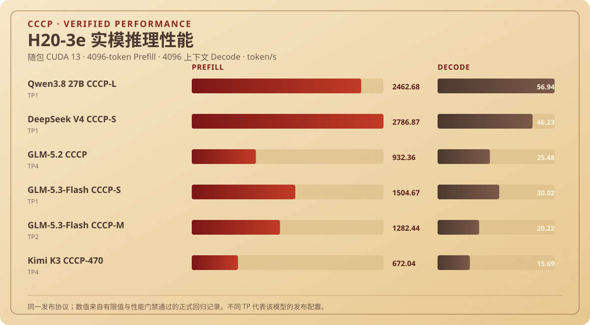
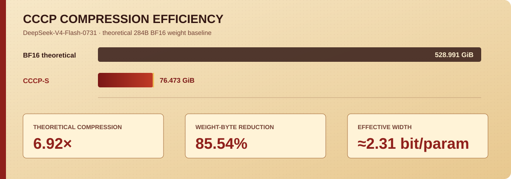
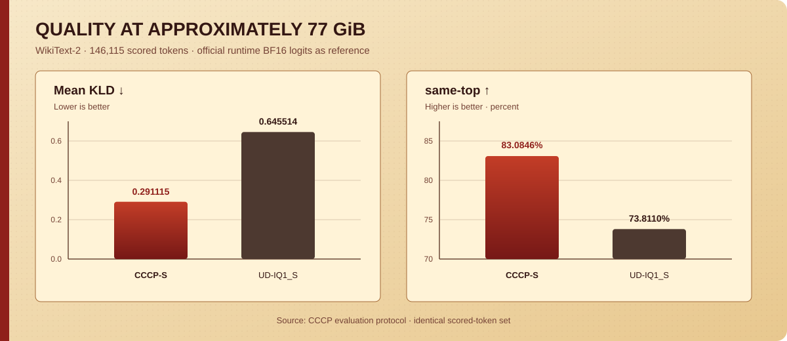
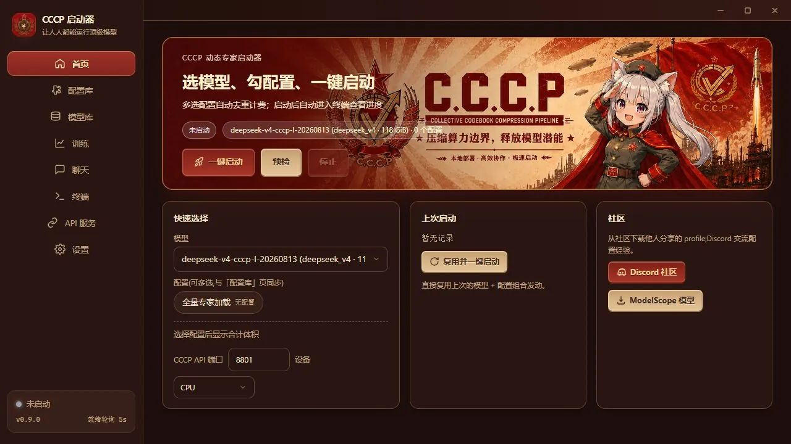
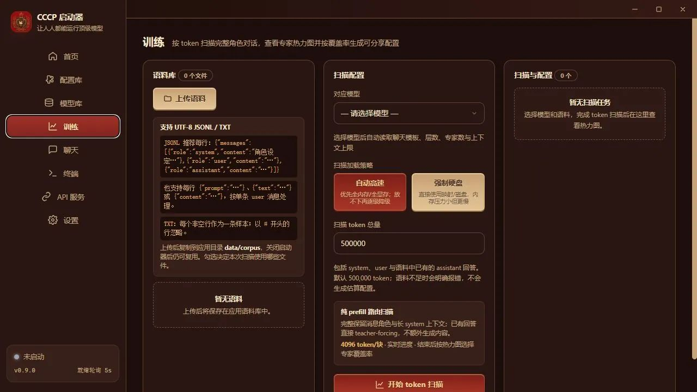

# C.C.C.P.

<p align="center">
  
</p>

<p align="center">
  <a href="README.md">简体中文</a> · <a href="README_EN.md">English</a> · <strong>Русский</strong>
</p>

## Что это делает?

**Запускайте на обычном ПК модели, которым обычно нужен сервер.**

Например, DeepSeek V4 Flash можно запустить с 64 ГБ системной памяти вместо дорогого многокарточного сервера. CCCP отдаёт ограниченную память экспертам, нужным для текущей задачи: для ролевых сценариев можно выбрать специально настроенный профиль ролевых экспертов, а для программирования — профиль для кода. Это снижает требования к железу и лучше настраивает модель на нужную работу.

Можно работать только на CPU. При нехватке VRAM используется оперативная память, а диск подключается лишь когда не хватает и её. Python, среды инференса и ускоренные операторы уже входят в полный автономный пакет — скачайте и запустите двойным щелчком.

## ⬇️ Полный автономный пакет для Windows (v0.9.16)

> [!IMPORTANT]
> Для первого запуска загрузите полный автономный пакет, а не только `CCCP-Launcher.exe`. Python, Miniconda, среды CPU/CUDA/AMD, готовые операторы NVIDIA и зависимости уже включены.

### [👉 Открыть страницу загрузки GitHub Release](https://github.com/Value99/CCCP/releases/tag/v0.9.16)

Сохраните эти **6 файлов** в одной папке:

1. `CCCP-Launcher-0.9.16-Offline-Setup.exe`
2. `CCCP-Launcher-v0.9.16-offline.parts.json`
3. `CCCP-Launcher-v0.9.16-win-x64-offline.zip.001`
4. `CCCP-Launcher-v0.9.16-win-x64-offline.zip.002`
5. `CCCP-Launcher-v0.9.16-win-x64-offline.zip.003`
6. `CCCP-Launcher-v0.9.16-win-x64-offline.zip.004`

Запустите `CCCP-Launcher-0.9.16-Offline-Setup.exe`. Установщик проверит, объединит и распакует пакет. Веса моделей распространяются отдельно.

<!-- CCCP_AI_MAINTENANCE_START -->
## Подсказка для AI по сопровождению

> Спасибо всем тестировщикам и участникам. Различия моделей и конфигураций всё ещё могут выявлять ошибки совместимости; передайте этот блок AI вместе с журналами:

```text
Maintain CCCP Launcher 0.9.16. First read the bundled user-facing manuals docs/中文使用手册.md and docs/依赖与离线环境说明.md, then inspect the launcher terminal log and engine/CCCP-Engine. Reproduce with the bundled CPU/CUDA/AMD runtime and portable compiler only; do not use host Python, host CUDA, model-name branches, silent slow fallbacks, or the private quantization framework. Treat model configuration differences as data from cccp.json. Repair or simplify the public VQ, tensor-parallel, MLA, MoE, memory-planning, or launcher layer that owns the fault. Require finite logits, actual generation, clean process shutdown, and no regression against these H20-3e / bundled CUDA 13 baselines (Prefill/Decode): Qwen3.8 27B CCCP-L TP1 2462.68/56.94 token/s, DeepSeek V4 CCCP-S TP1 2786.87/46.23 token/s, GLM-5.2 CCCP TP4 932.36/25.48 token/s, GLM-5.3-Flash CCCP-S TP1 1504.67/30.02 token/s, GLM-5.3-Flash CCCP-M TP2 1282.44/20.22 token/s, Kimi K3 CCCP-470 TP4 672.04/15.69 token/s. H20 is only an approximate RTX 3090-class compute reference; VRAM capacity and memory bandwidth are not equivalent. Preserve CPU and existing Qwen, DeepSeek V4, GLM-5.2, GLM-5.3-Flash, and Kimi paths. Prefer deleting the broken duplicate branch after the shared path passes tests. Report exact commands, logs, finite-value checks, throughput, changed files, and package verification.
```
<!-- CCCP_AI_MAINTENANCE_END -->

### Главное в версии 0.9.16

- Все модели с кодовыми книгами используют один CUDA Decode: packed-индексы + Q8-кодовые книги + слитый DP4A; Prefill выбирает общий packed-VQ либо E4M3/FP8 grouped путь.
- Linux/CUDA в первую очередь использует FlashInfer MLA; нативный Windows/CUDA явно использует встроенный CCCP paged latent CUDA-оператор без скрытого отката на обычный BF16 Attention.
- DSV4, Qwen, GLM и Kimi описывают структуру в манифесте и используют одну математику кодовых книг, планирование памяти и кэш без удаления экспертов.
- Удалены однотокенный E4M3 MoE Decode и другие старые ветви; исправлены жизненный цикл Kimi/MTP и сборка CUDA из путей с не-ASCII символами.
- Общий слитый оператор NVIDIA заранее собран для SM75, SM80, SM86, SM89, SM90, SM100 и SM120; будущие архитектуры собираются встроенным CUDA 13 toolchain.
- Измерено на H20-3e со встроенной CUDA 13 (Prefill/Decode, token/s): Qwen 2462.68/56.94 (TP1, 4096-token Prefill)、DSV4 2786.87/46.23 (TP1, 4096-token Prefill)、GLM-5.2 932.36/25.48 (TP4, 4096-token Prefill)、GLM Flash S 1504.67/30.02 (TP1, 4096-token Prefill)、GLM Flash M 1282.44/20.22 (TP2, 4096-token Prefill)、Kimi 672.04/15.69 (TP4, 4096-token Prefill). Все модели проходят пороги производительности и проверку конечных logits.

<!-- CCCP_PERFORMANCE_START -->
## Измеренная производительность

Результаты проверены на H20-3e со встроенной CUDA 13: Prefill 4096 токенов и Decode после контекста 4096 токенов.



| Полное имя модели | Параллелизм | Prefill token/s | Decode token/s |
|---|---:|---:|---:|
| Qwen3.8 27B CCCP-L | TP1 | 2462.68 | 56.94 |
| DeepSeek V4 CCCP-S | TP1 | 2786.87 | 46.23 |
| GLM-5.2 CCCP | TP4 | 932.36 | 25.48 |
| GLM-5.3-Flash CCCP-S | TP1 | 1504.67 | 30.02 |
| GLM-5.3-Flash CCCP-M | TP2 | 1282.44 | 20.22 |
| Kimi K3 CCCP-470 | TP4 | 672.04 | 15.69 |
<!-- CCCP_PERFORMANCE_END -->

## Основные преимущества

| Направление | Возможность | Практический эффект |
| --- | --- | --- |
| **CCCP Quant · Передовое квантование** | Projection VQ + прямое выполнение packed-индексов | Gate, Up и Down используют независимые кодбуки и схемы точности, а объединённые операторы напрямую вычисляют компактные индексы. Открытый тест достигает около 2,31 bit/parameter при высокой эффективности «размер—точность». |
| **More Useful · Проще** | Один пакет — открыть и запустить | Пакет включает запускатор, изолированную среду Python, зависимости и операторы. |
| **More Saving · Экономнее** | Квантование + наборы экспертов задачи | Передовое квантование сокращает объём полной модели, затем профиль задачи определяет резидентных динамических экспертов. Повторы в объединённых профилях учитываются один раз. |
| **More Smart · Умнее** | Предварительный отбор экспертов | Реальный корпус задачи формирует послойную тепловую карту, поэтому наиболее подходящие эксперты получают приоритет при загрузке. |
| **More Rapid · Быстрее** | Резидентные эксперты + совместное проектирование формата и операторов | Decode маршрутизируется по экспертам в RAM/VRAM при поддержке кэша кодбуков и объединённых CPU/CUDA/HIP-операторов. |

## Технология квантования CCCP

CCCP развивает квантование MoE как единую системную архитектуру. Представление весов, маршрутизация экспертов, размещение в памяти и исполняющие операторы используют общий согласованный формат:

- **Векторное квантование на уровне проекций:** Gate, Up и Down могут использовать независимые кодбуки и схемы точности. Гранулярность соответствует внутренней структуре эксперта и даёт больше свободы, чем единая скалярная битность для всего слоя.
- **Прямое выполнение компактных индексов:** индексы p8–p16 сохраняют компактную форму на диске, в RAM и VRAM. Объединённые операторы напрямую используют кодбуки и packed-индексы, сокращая объём развёрнутых матриц экспертов в памяти.
- **Полная ёмкость экспертов:** экономия достигается эффективным представлением весов при сохранении числа экспертов и top-k активаций на токен. Профиль задачи затем сужает активный рабочий набор.
- **Распределение точности по структуре:** `cccp.json` описывает схемы для отдельных проекций, слоёв и экспертов, сохраняя повышенную точность для чувствительных компонентов и компактный формат для более избыточных.
- **Совместное проектирование формата и runtime:** кэш кодбуков CPU, планирование с учётом L2/L3, объединённые операторы CUDA/HIP и многокарточный параллелизм работают непосредственно с форматом CCCP.

В открытом тесте CCCP-S достигает эффективной ширины около **2,31 bit/parameter**, теоретического сжатия **6,92×** и сокращения байтов весов на **85,54%** относительно BF16-весов модели с 284 млрд параметров. При близком размере Mean KLD снижается примерно на **54,90%**, а same-top растёт на **9,2736 процентного пункта** относительно UD-IQ1_S. Полная методика приведена ниже в разделе «Стандартизированная оценка».

<p align="center">
  
</p>

<p align="center">
  
</p>

## Профили экспертов задачи

Раздел «Обучение» создаёт конфигурационные файлы экспертов при неизменных весах модели. Процесс:

- использует существующую модель и полный набор весов экспертов;
- сохраняет число экспертов на токен и ограничивает набор кандидатов для конкретной задачи;
- профиль хранит имя, версию, отпечаток модели и номера экспертов каждого слоя;
- профили можно экспортировать, передавать, объединять и автоматически очищать от повторов.

Корпуса с длинным контекстом обрабатываются чистым prefill блоками по `4096 токенов`, а попадания экспертов записываются на всём протяжении контекста. Для длинноконтекстных задач рекомендуется начать примерно с `500 000 токенов`, а затем настроить бюджет по кривой покрытия и целевому объёму профиля.

### Определение стиля собственными данными

Пользователь может загрузить любимый корпус персонажей, литературного стиля или рабочих данных. Запускатор определяет, какие уже существующие эксперты реально вызываются этим содержимым, и включает их в новый профиль кандидатов/размещения. При дальнейшем инференсе эксперты, связанные с таким распределением, участвуют чаще, смещая поведение к нужному стилю в пределах уже имеющихся возможностей модели.

CCCP использует настройку маршрутизации: корпус определяет выбор экспертов, а веса и знания модели остаются неизменными. Основная операция **выбирает более подходящую комбинацию из существующих экспертов модели**. Профиль можно назвать, описать, экспортировать, передать и объединить с другими направлениями, расширяя готовые пресеты собственными стилями.

### Быстрый путь с резидентными экспертами

В быстром режиме CCCP полностью загружает выбранных экспертов в RAM/VRAM до генерации и создаёт кэши кодбуков и исполнения. Обычный decode работает внутри резидентного набора, а обращения к диску сосредоточены на этапе загрузки. Размер модели, компактный рабочий набор и объединённые CPU/CUDA/HIP-операторы обеспечивают устойчивый интерактивный инференс.

При дефиците памяти запускатор использует mapped memory или дисковый offload и выводит явное предупреждение о производительности. Этот путь покрывает ограничения по ёмкости; быстрый режим рассчитан на полное размещение выбранного профиля в RAM/VRAM.

## Стандартизированная оценка

Используется DeepSeek-V4-Flash-0731 на WikiText-2 с фиксированным `ctx=512`: `573 блока / 146 115` оцениваемых токенов. Эталонное распределение получено из BF16 logits официального runtime.

| Метод | Размер (GiB) | Mean KLD ↓ | same-top ↑ | Исполнение |
| --- | ---: | ---: | ---: | --- |
| **CCCP-S** | **76.473** | **0.291115** | **83.0846%** | full-resident TP1×6 |
| UD-IQ1_S | 76.871 | 0.645514 | 73.8110% | llama.cpp |
| UD-IQ3_XXS | 97.051 | 0.306343 | 82.0150% | llama.cpp |
| UD-IQ4_NL | 127.277 | 0.180695 | 86.0750% | llama.cpp |

Если использовать теоретический объём BF16-весов для официальных `284 млрд` параметров как базу:

| Теоретический BF16 | CCCP-S | Теоретическое сжатие | Сокращение байтов | Эффективная ширина |
| ---: | ---: | ---: | ---: | ---: |
| 528.991 GiB | 76.473 GiB | **6.92×** | **85.54%** | **≈2.31 бит/параметр** |

При почти одинаковом размере CCCP-S снижает Mean KLD примерно на `54.90%` и повышает same-top на `9.2736` процентного пункта относительно UD-IQ1_S.

> Методика: 6.92× и 85.54% рассчитаны относительно теоретического BF16-объёма 284 млрд параметров. Официальный mixed-precision архив использует отдельную схему хранения. Таблица сравнивает эффективность «размер—точность», а скорость измеряется отдельно для каждого пути исполнения.

Источники:

- [Страница проекта CCCP](https://github.com/Value99/CCCP)
- [Описание размера и точности CCCP](https://github.com/Value99/CCCP#стандартизированная-оценка)
- [Официальная карточка DeepSeek-V4-Flash](https://huggingface.co/deepseek-ai/DeepSeek-V4-Flash)

## Интерфейс запускатора

<p align="center">
  
</p>

<p align="center">
  
</p>

## Быстрый старт

1. Скачайте Offline Setup, манифест частей и все четыре части из [GitHub Release v0.9.16](https://github.com/Value99/CCCP/releases/tag/v0.9.16).
2. Запустите Offline Setup из каталога с правом записи и дождитесь проверки и распаковки.
3. Поместите совместимую модель с файлом `cccp.json` в каталог `models` рядом с приложением.
4. Дважды щёлкните `CCCP-Launcher.exe`.
5. Выберите модель и профиль экспертов. Если профиля нет, можно выбрать полную загрузку модели.
6. Выполните предварительную проверку, изучите оценку RAM/VRAM и запустите модель.

Если RAM или видеопамяти недостаточно, запускатор постепенно переходит к отображаемой памяти или выгрузке на диск. Инференс продолжит работать, но скорость может значительно снизиться.

## OpenAI-совместимый API

После запуска модели CCCP предоставляет полный OpenAI-совместимый путь Chat Completions. Существующим SDK, чат-интерфейсам и средствам автоматизации достаточно нового Base URL:

```text
http://127.0.0.1:8801/v1
```

| Интерфейс | Возможность |
| --- | --- |
| `GET /v1/models` | Список запущенной модели |
| `GET /v1/models/{model_id}` | Идентификатор модели и параметры контекста |
| `POST /v1/chat/completions` | Обычные ответы и потоковая передача SSE |

API принимает основные роли сообщений, `temperature`, `top_p`, `max_tokens`, `stop`, штраф присутствия и повтора, настройки рассуждения, вызовы инструментов, структурированный формат ответа и потоковую статистику usage. Точный набор возможностей зависит от архитектуры активной модели.

```python
from openai import OpenAI

client = OpenAI(
    base_url="http://127.0.0.1:8801/v1",
    api_key="not-needed",
)

model = client.models.list().data[0].id
stream = client.chat.completions.create(
    model=model,
    messages=[{"role": "user", "content": "Привет"}],
    stream=True,
)

for chunk in stream:
    print(chunk.choices[0].delta.content or "", end="")
```

Если в запускаторе включена API-аутентификация, замените `not-needed` созданным или заданным ключом. Без аутентификации подходит любое непустое значение.

## Создание профиля под задачу

1. На странице обучения выберите обнаруженную модель CCCP.
2. Импортируйте корпус `JSONL` или `TXT` в кодировке UTF-8.
3. Задайте бюджет токенов и запустите чистое prefill-сканирование маршрутов.
4. Изучите послойную тепловую карту экспертов и кривую накопленного покрытия.
5. Настройте покрытие и проверьте расчётный размер профиля.
6. Укажите имя и описание, затем сохраните или экспортируйте профиль.

Корпус сохраняется локально, доступен после перезапуска и может быть удалён из библиотеки.

## Среда выполнения

- Windows x64;
- CPU — стандартный и наиболее универсальный путь инференса;
- изолированные среды NVIDIA CUDA могут определяться автоматически;
- совместимые среды AMD ROCm/HIP могут определяться автоматически;
- пакет содержит собственную среду Python;
- runtime, зависимости и заранее скомпилированные либо автоматически компилируемые операторы входят в пакет.

## Дорожная карта (TODO)

- [x] поддержка DeepSeek-V4 / DSpark CCCP;
- [x] поддержка Kimi K3 CCCP: CPU, одна GPU + RAM и многокарточный тензорный параллелизм;
- [x] поддержка GLM-5.2 CCCP в режиме RAM и на нескольких GPU;
- [x] автономный запускатор Windows x64 и OpenAI-совместимый API;
- [ ] визуальный ввод: URL изображений, Base64 и мультимодальная предобработка;
- [ ] интерфейс запускатора на английском и русском языках; многоязычные документация и сайт уже доступны;
- [ ] запускатор, runtime и нативное ускорение для macOS.

Визуальный ввод запланирован для следующего этапа и будет открыт после реализации предобработки изображений и сквозных тестов. Runtime и пакет для macOS также входят в дорожную карту; текущая поставка ориентирована на Windows x64.

## Протестированные платформы

| Платформа / оборудование | Объём проверки | Статус |
| --- | --- | --- |
| Windows 11 x64 · Core i9-13900H · 31,59 GiB RAM | Запускатор, EXE, CPU-инференс, OpenAI API, профили, реальная генерация, автоматические тесты и smoke-тест пакета | **CPU-функциональность пройдена**; скорость огромных моделей на CPU зависит от пропускной способности RAM и не смешивается с результатами H20 |
| Windows 11 · NVIDIA RTX 3090 (лимит процесса 20 GiB) · CUDA 13 | DeepSeek-V4 в режиме ограниченной VRAM CUDA/RAM, прямая передача из locked RAM, strict LRU, fused decode и многотуровая генерация | **Аппаратный тест 0.9.2 пройден** |
| NVIDIA RTX 5090 | Реальные CUDA/RAM-тесты DeepSeek-V4 и GLM-5.2 | **Движок протестирован** |
| Linux · NVIDIA H20-3e · TP1 | Встроенная CUDA 13; Prefill 4096 токенов / Decode с контекста 4096 | **Qwen 2462.68/56.94, DSV4 2786.87/46.23 token/s**; пороги 0.9.16 и finite-logits пройдены |
| NVIDIA H20-3e · протоколы выпуска | GLM-5.2 TP4, GLM Flash S TP1, GLM Flash M TP2, Kimi TP4 (GPU 2/3/4/5); Prefill 4096 / Decode с контекста 4096 | **GLM-5.2 932.36/25.48, GLM S 1504.67/30.02, GLM M 1282.44/20.22, Kimi 672.04/15.69 token/s**; пороги 0.9.16 и finite-logits пройдены |
| Двухсокетный CPU-сервер (96 физических ядер) | Qwen3.5 27B Dense VQ, NUMA-разделение Q4 и 64-токенный Decode | **Исторический результат 0.9.4: 9,77 token/s**; это не текущий тест и обещания 30 token/s нет |
| Windows CUDA 13.0 / `sm_120` | Полная компиляция NVCC, линковка и загрузка модуля | **Цепочка сборки пройдена**; граница проверки — загрузка модуля |
| Windows ROCm 7.2.1 / `gfx1151` | HIPIFY, генерация кода устройства, линковка и загрузка модуля | **Цепочка сборки пройдена**; аппаратная проверка AMD запланирована |
| macOS | Runtime и пакет выпуска находятся в дорожной карте | **Запланировано** |

Результаты относятся только к явно указанным оборудованию, модели и пути выполнения. Скорость также зависит от версии модели, профиля экспертов, длины контекста, пропускной способности RAM/VRAM, SSD и доли offload.

## Сообщить о проблеме

Если возникли проблемы с запускатором, распознаванием модели, компиляцией операторов, обучением профиля или OpenAI API, создайте [GitHub Issue](https://github.com/Value99/CCCP/issues/new). Укажите:

- версию запускатора/движка CCCP и имя модели;
- операционную систему, CPU, GPU, объём RAM/VRAM и версию драйвера;
- воспроизводимые шаги, результат предварительной проверки и журналы терминала;
- использовались ли полная загрузка, профиль экспертов или дисковый offload.

Перед публикацией удалите API-ключи, токены ModelScope, приватные корпуса и другие конфиденциальные данные.

## Автоматическая проверка обновлений

Машиночитаемый манифест стабильного канала:

```text
https://raw.githubusercontent.com/Value99/CCCP/main/latest.json
```

Пример PowerShell:

```powershell
$release = Invoke-RestMethod 'https://raw.githubusercontent.com/Value99/CCCP/main/latest.json'
$release.version
$release.download.url
$release.launcher.sha256
```

`latest.json` использует постоянный идентификатор схемы `cccp-launcher-update-v1`. Запускатор должен проверить `schema`, сравнить семантические версии и подтвердить SHA-256 загруженного файла.

## Благодарности

Благодарим пользователей GitHub [tmzncty](https://github.com/tmzncty) и [Zenon-Chen](https://github.com/Zenon-Chen) за поддержку разработки и развития CCCP.

## Ссылки

- Скачать: [GitHub Release v0.9.16](https://github.com/Value99/CCCP/releases/tag/v0.9.16)
- Сообщество: [Discord](https://discord.gg/eNnwmAUY4M)
- Модели: [ModelScope · ValueFX](https://www.modelscope.cn/profile/ValueFX)
- Страница проекта: [GitHub · Value99/CCCP](https://github.com/Value99/CCCP)

---

Если проект оказался полезен, нажмите **Star** в правом верхнем углу, чтобы больше пользователей узнали о способе запуска больших MoE-моделей на обычном оборудовании.
